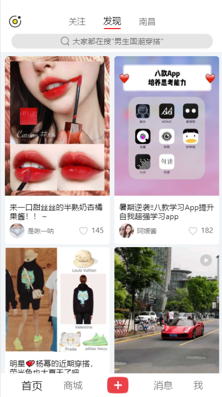
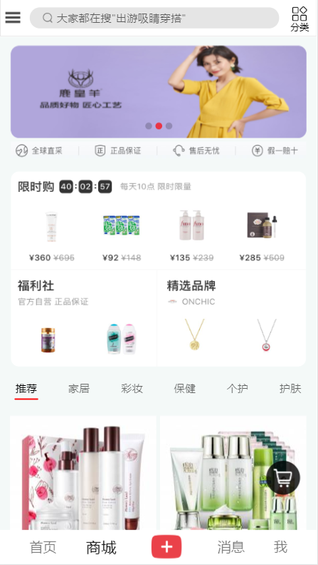
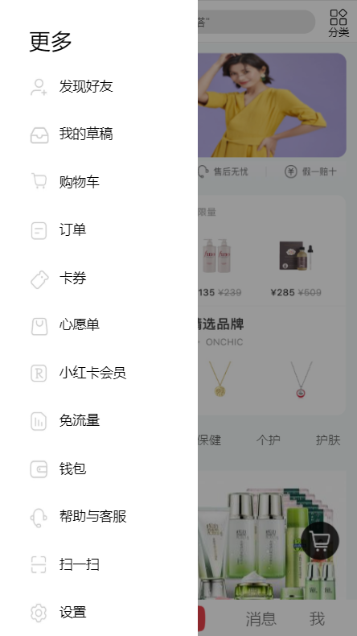
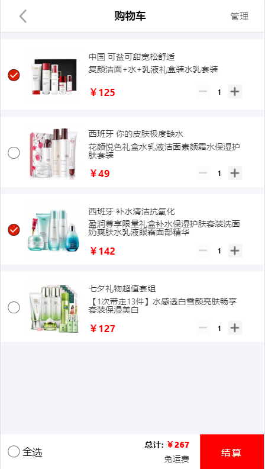
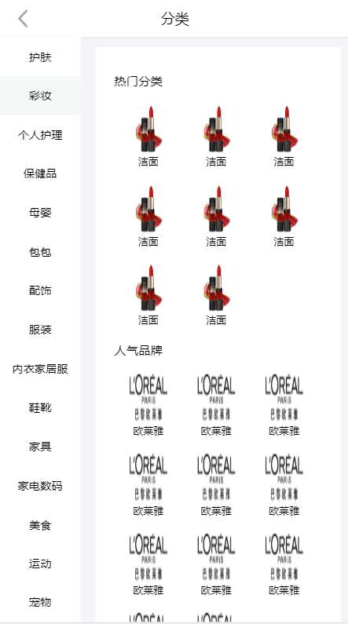
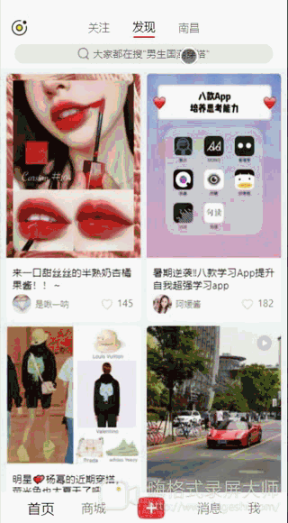

# 创建项目过程
create-react-app react-redbook 
cd react-redbook 
git add . 
git commit -m 'Saving before ejecting' 
npm run eject  运行npm run eject生成配置文件(解压 webpack 配置) 

# React实战小红书App(含截图和录屏)

## 技术栈
技术栈: React + ES6 + redux + axios + stylus + webpack + react-lazyload 
UI框架: swiper + better-scroll + antd-mobile 

## 项目进度
7-06 项目环境搭配完成 
7-11 完成首页部分功能 
7-14 首页样式基本完成 功能完成一部分 模拟EasyMock假数据 
7-15 完成商城首页部分功能和样式 完成侧边弹出栏 
7-16 完成搜索功能 部分页面路由跳转 路由传参 
7-20 完成商品展示 商品分类展示 
7-21 完成商品详情 以及其他小功能 
7-23 项目主要功能基本完成 后续继续完善 

# 项目运行截图和录屏

## 项目截图
<figure class="half">
    
    
    
    
    
    
    
</figure>

## 项目录屏

<figure class="half">
    <h3>首页</h3>
    
    <h3>搜索页</h3>
    
    <h3>商城页操作</h3>
    
    <h3>添加购物车</h3>
    
    <h3>订单操作</h3>
    
    <h3>滚动吸顶效果</h3>
    
</figure>
